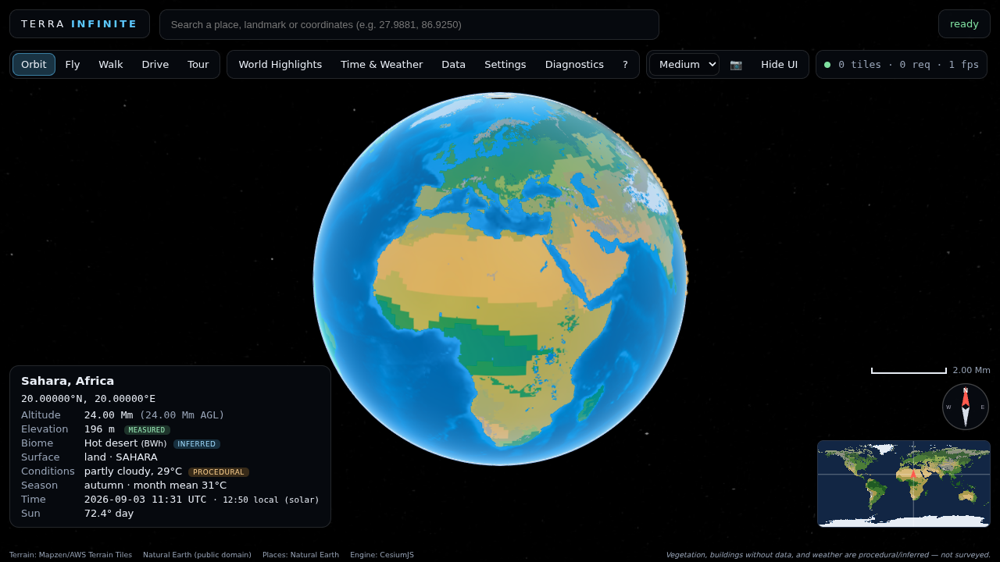
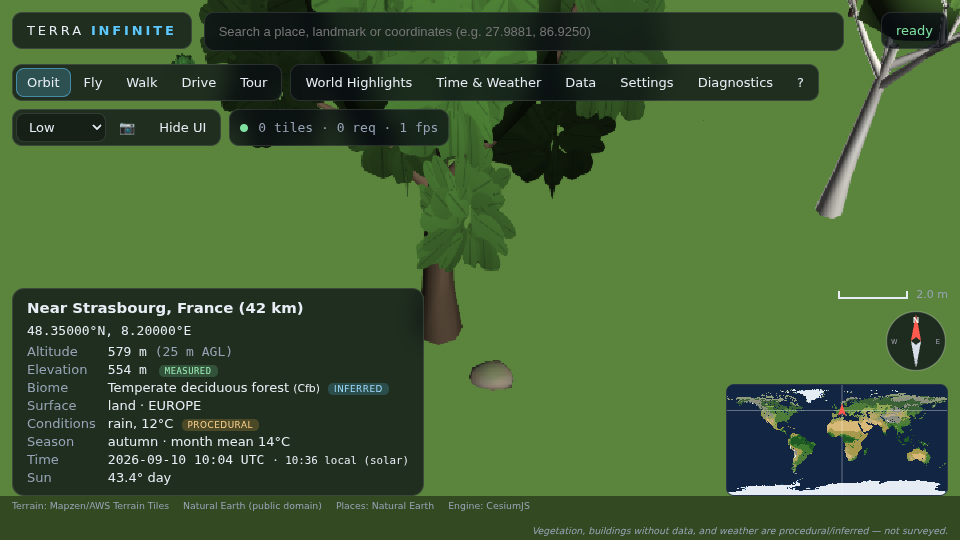
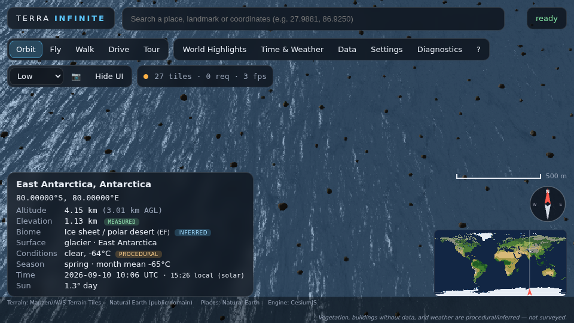
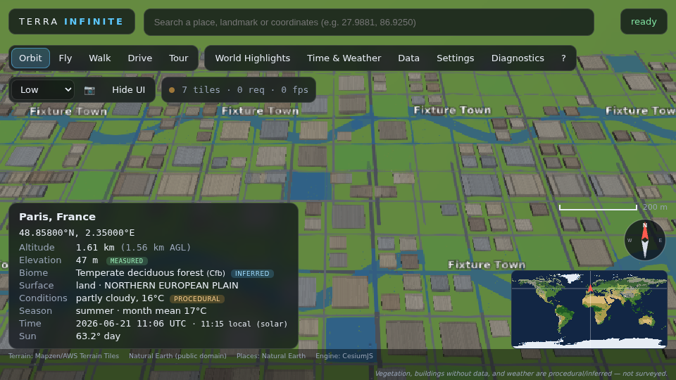
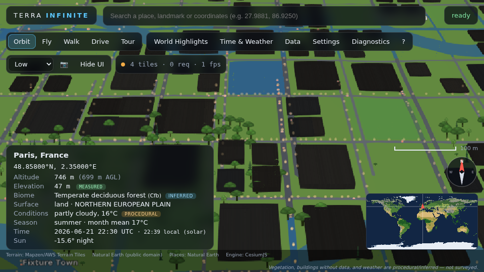
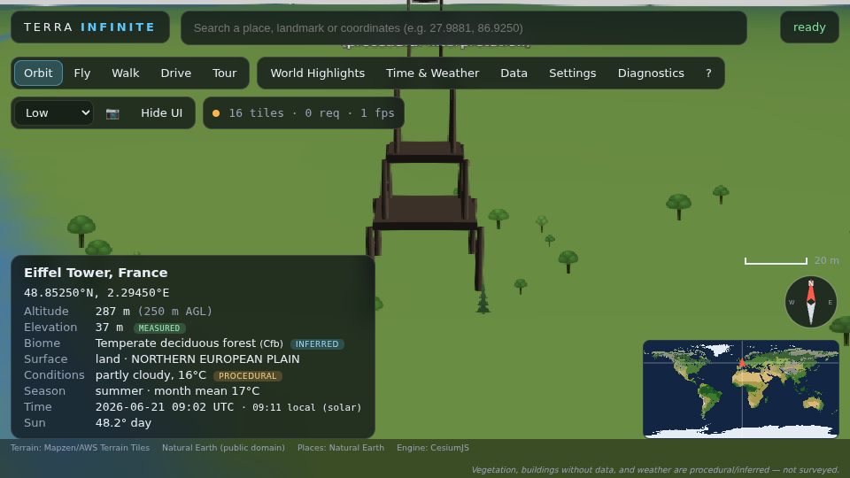
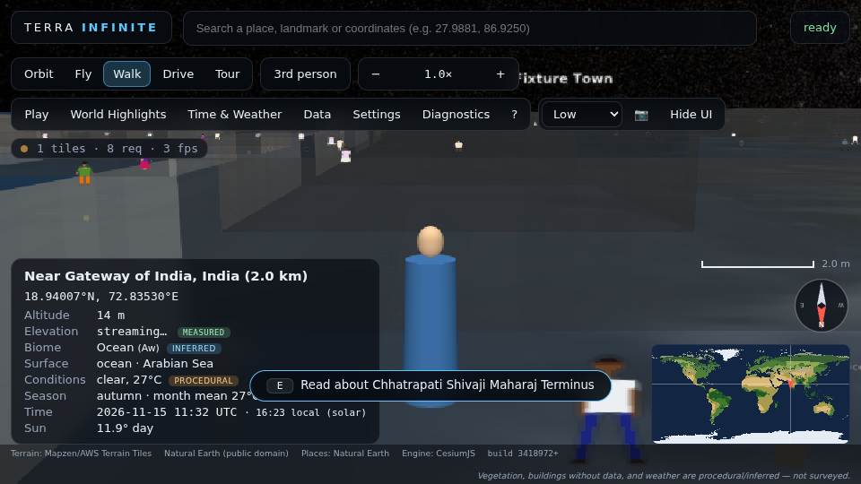
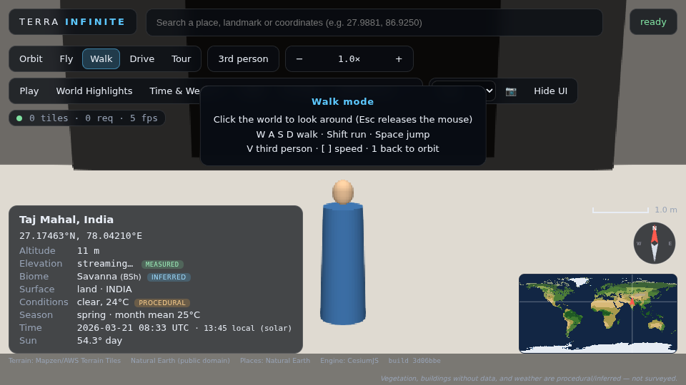
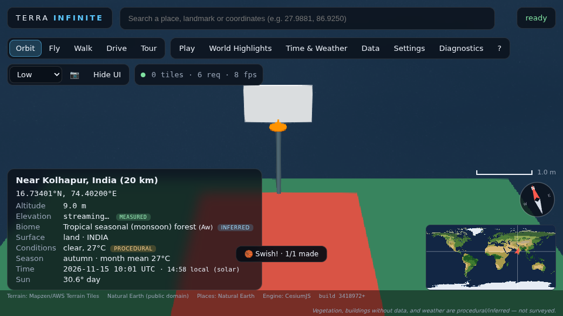

# Terra Infinite

An explorable, streamed 3D Earth in the browser: from orbit to continents, cities, streets, fields, forests and individual trees with leaves, flowers and seasonal fruit. Built with TypeScript, React, Vite and CesiumJS on open geospatial data plus deterministic procedural generation.

* **Real where data exists** — AWS/Mapzen Terrarium terrain (SRTM, GMTED, ETOPO), Natural Earth coastlines/rivers/borders/places, OpenStreetMap buildings/roads/water/land use, optional satellite imagery (NASA GIBS, Esri, MapTiler, Cesium ion).
* **Plausible where it does not** — an inferred climate atlas (400+ station normals → Köppen → biome), biome-specific vegetation with phenology, procedural ground materials, villages and urban blocks, simulated weather. Every readout says whether it is *measured*, *inferred*, *procedural* or *live*.
* **No keys required** — the demonstration mode runs on open, key-less sources; keyed providers are opt-in through `.env`.

## What it looks like

| Orbit | Close to a procedural tree (Black Forest, September) | Antarctic plateau |
|---|---|---|
|  |  |  |

| Synthetic city fixture by day | …and at night (window emission, street lamps) | Eiffel Tower stand-in (procedural interpretation) |
|---|---|---|
|  |  |  |

The city frames use the built-in **synthetic OpenStreetMap fixture** (`?terraFixtures=1`) because the build sandbox cannot reach the Overpass API; with network access the same code streams real OSM buildings, roads and land use. All frames were rendered with software WebGL (SwiftShader) at the *Low* preset, which is why they look flat-shaded; on a GPU the High/Ultra presets add MSAA, shadows, ambient occlusion and HDR.

## Maharashtra first — the playable vertical slice

The world is being built **Maharashtra first, then Earth** (`docs/PLAN_MAHARASHTRA.md`). Open **Play** in the toolbar
and spawn as a walking character at one of the Maharashtra spawn points (Gateway of India, Marine Drive, CSMT,
Shaniwar Wada, the Mahalaxmi temple lanes in Kolhapur, Deekshabhoomi, Mahabaleshwar, Ganpatipule, a fictionalised
school-inspired campus near Kolhapur, a closed-course hill time trial near Lonavala, a procedural showroom in Worli)
or at the Taj Mahal in Agra, the first hero destination outside the state.

| Gateway of India (walk) | Taj Mahal hero reconstruction (walkable, procedural) | Living world: crowd in the CSMT forecourt |
|---|---|---|
|  |  |  |

What the slice contains (browser client, all verified headless in Chromium with software WebGL — see
`PROJECT_STATUS.md` for the exact test that covers each item):

* **Player**: spawn, walk/run/jump, first/third person, `E` to interact, fade-to-safe-respawn on falls.
* **Maharashtra data**: 16 cities and 60+ destinations searchable offline, landmark stand-ins (Gateway of India,
  CSMT, Sea Link, Shaniwar Wada, Raigad, Ajanta/Ellora, Bibi Ka Maqbara, Deekshabhoomi, …), showcase tours.
* **Interiors**: a deterministic procedural interior grammar (residential, office, school, hotel, hospital, mall,
  restaurant, museum, station, airport, showroom, cruise) — enter a supported building through its door, use
  stairs and elevators, leave through the same door. Every generated interior is labelled *fictional*.
* **School-inspired campus**: an original, fictionalised campus near Atigre with entrance grounds, academic
  blocks, library, laboratories, art room, auditorium, cafeteria, sports areas, admin rooms and a railed terrace.
* **Vehicles**: generic hatchback, SUV, sports car, bus, taxi, truck and auto-rickshaw with arcade handling,
  headlights/indicators/horn, stuck reset, AI traffic with lanes and emergency braking, pooled pedestrians, a closed
  time-trial course and a procedural showroom with inspection cameras and test drives.
* **Journeys**: rail (real corridors and stations, block signalling, platforms, in-game tickets), air (Maharashtra
  airports, terminal → gate → take-off → cruise → landing), ferry Gateway ↔ Mandwa, arcade speedboat courses and a
  cruise ship with walkable public decks along the Konkan coast. All passenger-side; no real operating procedures.
* **Living world**: regional crowds and stalls, cattle/dogs/birds, monsoon season, photography challenges,
  landmark collection, heritage tours, nature logbook, clean-up activities, basketball at the campus court.
* **Performance contract**: hardware detection, current/average/1 % low FPS, frame time, memory, tiles, actors and
  draw calls in Diagnostics, Low/Medium/High/Ultra/Performance presets, an adaptive degradation ladder with dynamic
  resolution, a readiness gate (the pill never says *ready* while a required layer failed or the FPS gate is
  unmet), and `npm run perf` benchmarks. Numbers measured so far come from software rendering; see `PERFORMANCE.md`.
* **Unreal Engine 5 client** (`unreal/TerraInfinite`): the intended principal AAA client, scaffolded as C++ +
  config + generated data tables. It has **never been compiled** — this repository is developed in a cloud sandbox
  without Unreal or a GPU. `docs/UNREAL.md` lists the exact installation requirements and verification gates.

Nothing procedural is presented as real: interiors, the campus, landmark bodies, showrooms, vehicles, timetables and
tickets carry a visible *procedural / fictional / approximate* note in the interface.

## Quick start

```bash
git clone https://github.com/Sarthak87677/game2.git terra-infinite
cd terra-infinite
npm run setup        # installs dependencies, creates .env from .env.example, prepares derived Natural Earth data
npm run dev          # http://127.0.0.1:5173
```

Requirements: Node 20+, a WebGL2-capable browser (Chrome/Edge/Firefox/Safari 15+). A GPU is strongly recommended.

## Commands

| Command | What it does |
|---|---|
| `npm run setup` | One-shot setup (install, `.env`, derived data) |
| `npm run dev` | Development server with hot reload |
| `npm run typecheck` | Strict TypeScript check |
| `npm run lint` | ESLint (`src`, `tests`) |
| `npm test` | Unit and integration tests (vitest) |
| `npm run build` | Typecheck + production build into `dist/` (copies Cesium engine assets) |
| `npm run preview` | Serve the production build at http://127.0.0.1:4173 |
| `npm run test:e2e` | Playwright visual smoke tests against the production preview (build first) |
| `npm run test:all` | typecheck → unit → build → e2e |
| `npm run perf` | Headless performance measurement → `docs/performance-*.json` |
| `npm run assets:process` | Regenerate `public/data/ne/*` from Natural Earth (includes the 1:10m coastline for detail regions) |
| `npm run unreal:export` / `npm run unreal:check` | Regenerate / verify the Unreal data tables from `src/data/maharashtra` |

Offline development without the Overpass API:

```bash
TERRA_FIXTURES=1 VITE_OVERPASS_URL=/__fixtures/overpass npm run dev
```

## Exploring

* **Search** (`/`): place names, landmarks, ecosystems, or coordinates (`27.9881, 86.9250`, `40°42'46"N 74°00'22"W`).
* **World Highlights**: 246 bookmarks across every continent and 19 polished showcase areas (New York, Mumbai, rural Punjab, Everest, Antarctica, Amazon, Sahara, Alps, Tokyo, London, Paris, Dubai, Cape Town, Sydney, Singapore, São Paulo, Grand Canyon, Tristan da Cunha, Great Ocean Road) with cinematic tours.
* **Modes**: Orbit (1), Fly (2), Walk (3), Drive (4), Tour (5); `V` first/third person; `[`/`]` speed; `H` hide UI; screenshot from the toolbar. Keyboard, mouse, touch joysticks and gamepad are supported.
* **Time & Weather**: any UTC date/time (real sun position, day/night terminator, seasons), weather presets, "simulate from climate", optional live/historical Open-Meteo observations.
* **Settings**: quality presets (Low → Ultra), cache budget, accessibility (UI scale, contrast, reduced motion), procedural ambient audio, and one-time device location (**off by default**).

## Configuration

Copy `.env.example` to `.env`. All keys are optional:

| Variable | Purpose |
|---|---|
| `VITE_CESIUM_ION_TOKEN` | Cesium World Terrain + Bing imagery |
| `VITE_MAPTILER_KEY` | MapTiler satellite imagery |
| `VITE_DEFAULT_IMAGERY` / `VITE_DEFAULT_TERRAIN` | Startup providers |
| `VITE_OVERPASS_URL` / `VITE_NOMINATIM_URL` | Your own OSM service endpoints |
| `VITE_ENABLE_LIVE_WEATHER` | Disable network weather with `false` |
| `VITE_DISABLED_ADAPTERS` | e.g. `osm,nominatim,open-meteo` for a fully offline demo |

Secrets never go into source control; `.env` is git-ignored.

## Continuous integration

`.github/workflows/ci.yml` runs typecheck, lint, unit tests, the production build and the Playwright suite (with the synthetic OSM fixture and software WebGL) on every push and pull request, and uploads the screenshots and `dist/` as artifacts.

## Deployment

`npm run build` produces a static site in `dist/` (about 17 MB including Cesium engine assets and derived Natural Earth data). Serve it from any static host (Netlify, Vercel, GitHub Pages, S3+CloudFront, nginx):

```bash
npm run build
npx serve dist          # or copy dist/ to your host
```

Serve with HTTPS and keep `Cross-Origin-Opener-Policy: same-origin` if you enable SharedArrayBuffer-based features later. The attribution strip must stay visible in public deployments (provider terms).

## Documentation

* `ARCHITECTURE.md` — system design, LOD pipeline, floating origin, workers.
* `DATA_SOURCES.md` — every dataset with licence, coverage, resolution and provenance.
* `PROCEDURAL_GENERATION.md` — seeds, species rules, phenology, exclusions.
* `PERFORMANCE.md` — measurement method and controls.
* `PROJECT_STATUS.md` — resumable task ledger and next steps.
* `ATTRIBUTIONS.md` — required credits.

## Licence

MIT for the Terra Infinite source. Data and engine licences are listed in `ATTRIBUTIONS.md`.
